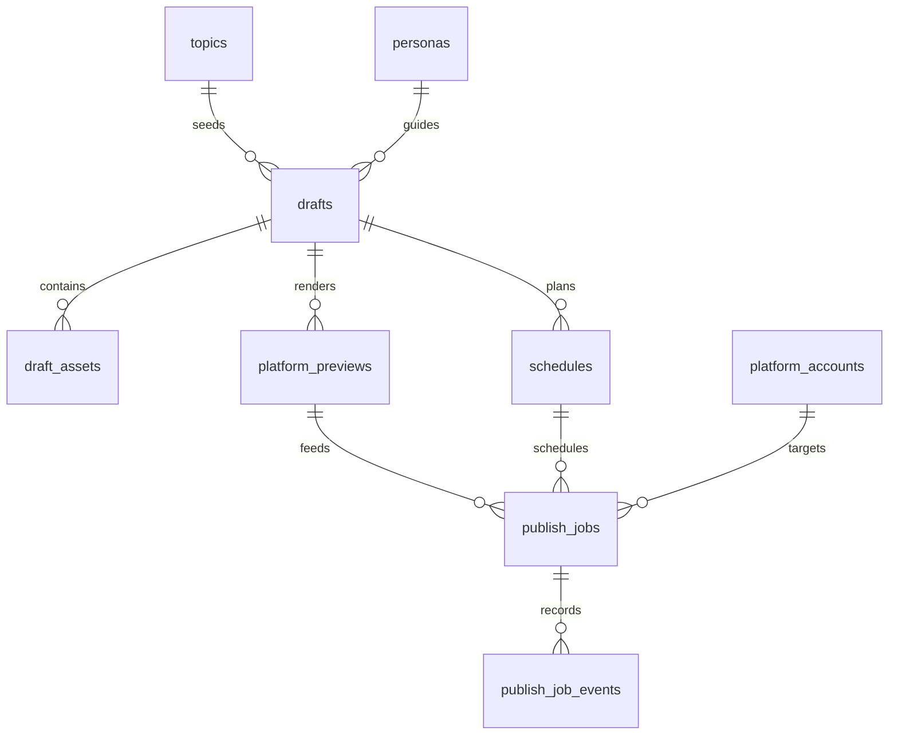

# PostgreSQL Schema: MindFlow MVP

## Purpose

This document defines the first PostgreSQL data model for MindFlow. It models the current AI content workbench workflow: choose a topic, select a persona, draft content, preview it per platform, schedule it, and track publishing jobs.

This is a small-project schema. It intentionally avoids sharding, CQRS, event sourcing, read replicas, generic metadata tables, and denormalized read models.

## Ownership Principles

- PostgreSQL is the MindFlow source of truth for drafts, schedules, platform previews, and publish job state.
- Platform credentials, cookies, browser profile data, and Playwright login state are not stored in PostgreSQL.
- AutoRepost task IDs may be stored only as external adapter references.
- Authentication is not implemented yet, so the MVP schema is single-operator. When auth is added, owner columns can be introduced through a migration.
- `jsonb` is allowed only for bounded adapter payloads, validation details, and source metadata that do not deserve first-class columns yet.

## Status Values

Use database check constraints or enum types for these values once migrations are created.

| Concept | Values |
| --- | --- |
| Draft status | `draft`, `generated`, `editing`, `ready`, `archived` |
| Asset status | `pending`, `ready`, `failed` |
| Platform | `douyin`, `weibo`, `xiaohongshu` |
| Preview status | `draft`, `valid`, `needs_review`, `blocked` |
| Schedule status | `scheduled`, `cancelled`, `completed` |
| Publish job status | `scheduled`, `queued`, `publishing`, `published`, `failed`, `cancelled` |
| Account connection status | `not_connected`, `connected`, `expired`, `disabled` |

## Tables

### `topics`

Stores trend or editorial topics that can seed drafts.

| Column | Type | Required | Notes |
| --- | --- | --- | --- |
| `id` | `uuid` | yes | Primary key. |
| `title` | `text` | yes | Human-readable topic. |
| `source_platform` | `text` | no | Example: `douyin`, `weibo`, `xiaohongshu`, `manual`. |
| `source_url` | `text` | no | Link to source when available. |
| `heat_score` | `integer` | no | Optional score from the radar source. |
| `signal` | `text` | no | Why this topic matters. |
| `raw_metadata` | `jsonb` | no | Bounded source payload. |
| `discovered_at` | `timestamptz` | yes | Defaults to current timestamp. |
| `created_at` | `timestamptz` | yes | Defaults to current timestamp. |

Constraints and indexes:

- Primary key on `id`.
- Check `heat_score` is null or between 0 and 100.
- Index `topics_discovered_at_idx` on `discovered_at desc` for the radar list.

### `personas`

Stores account voice templates.

| Column | Type | Required | Notes |
| --- | --- | --- | --- |
| `id` | `uuid` | yes | Primary key. |
| `name` | `text` | yes | Persona name. |
| `audience` | `text` | yes | Target audience. |
| `tone` | `text` | yes | Voice direction. |
| `instructions` | `text` | no | Generation guidance. |
| `is_active` | `boolean` | yes | Defaults to true. |
| `created_at` | `timestamptz` | yes | Defaults to current timestamp. |
| `updated_at` | `timestamptz` | yes | Updated by application code or trigger. |

Constraints and indexes:

- Primary key on `id`.
- Unique index `personas_name_unique` on `name`.
- Index `personas_active_idx` on `is_active` for active persona selection.

### `drafts`

Stores the canonical editable content record.

| Column | Type | Required | Notes |
| --- | --- | --- | --- |
| `id` | `uuid` | yes | Primary key. |
| `topic_id` | `uuid` | no | Foreign key to `topics.id`; nullable for manual drafts. |
| `persona_id` | `uuid` | no | Foreign key to `personas.id`; nullable if deleted later with restrict policy. |
| `title` | `text` | yes | Draft title. |
| `body` | `text` | yes | Canonical draft body. |
| `tags` | `text[]` | yes | Defaults to empty array. |
| `status` | `text` | yes | Draft status. |
| `generation_source` | `text` | no | Example: `mock`, `manual`, future model name. |
| `created_at` | `timestamptz` | yes | Defaults to current timestamp. |
| `updated_at` | `timestamptz` | yes | Updated by application code or trigger. |

Constraints and indexes:

- Primary key on `id`.
- Foreign key `topic_id` references `topics(id)` with `on delete set null`.
- Foreign key `persona_id` references `personas(id)` with `on delete set null`.
- Check `status` is one of the documented draft statuses.
- Index `drafts_updated_at_idx` on `updated_at desc` for recent drafts.
- Index `drafts_status_idx` on `status` for workbench filters.

### `draft_assets`

Stores media references attached to a draft.

| Column | Type | Required | Notes |
| --- | --- | --- | --- |
| `id` | `uuid` | yes | Primary key. |
| `draft_id` | `uuid` | yes | Foreign key to `drafts.id`. |
| `asset_type` | `text` | yes | Example: `image`, `cover`, `video`. MVP expects image-like assets. |
| `source_url` | `text` | no | Remote source if not stored locally. |
| `local_path` | `text` | no | Local or object-storage path after download/upload. |
| `alt_text` | `text` | no | Accessibility or editorial note. |
| `sort_order` | `integer` | yes | Display order. |
| `status` | `text` | yes | Asset status. |
| `created_at` | `timestamptz` | yes | Defaults to current timestamp. |

Constraints and indexes:

- Primary key on `id`.
- Foreign key `draft_id` references `drafts(id)` with `on delete cascade`.
- Check exactly one or both of `source_url` and `local_path` may be present, but at least one must exist once `status = 'ready'`.
- Unique index `draft_assets_draft_sort_unique` on `(draft_id, sort_order)`.
- Index `draft_assets_draft_id_idx` on `draft_id`.

### `platform_accounts`

Stores non-secret platform account connection records.

| Column | Type | Required | Notes |
| --- | --- | --- | --- |
| `id` | `uuid` | yes | Primary key. |
| `platform` | `text` | yes | `douyin`, `weibo`, or `xiaohongshu`. |
| `display_name` | `text` | yes | User-facing account name. |
| `external_account_id` | `text` | no | Platform account ID when known. |
| `connection_status` | `text` | yes | Non-secret connection state. |
| `last_checked_at` | `timestamptz` | no | Last adapter health/account check. |
| `notes` | `text` | no | Operational note. |
| `created_at` | `timestamptz` | yes | Defaults to current timestamp. |
| `updated_at` | `timestamptz` | yes | Updated by application code or trigger. |

Constraints and indexes:

- Primary key on `id`.
- Check `platform` and `connection_status` use documented values.
- Unique index `platform_accounts_platform_external_unique` on `(platform, external_account_id)` where `external_account_id is not null`.
- Index `platform_accounts_platform_status_idx` on `(platform, connection_status)`.

### `platform_previews`

Stores platform-specific renderings and validation output for a draft.

| Column | Type | Required | Notes |
| --- | --- | --- | --- |
| `id` | `uuid` | yes | Primary key. |
| `draft_id` | `uuid` | yes | Foreign key to `drafts.id`. |
| `platform` | `text` | yes | Target platform. |
| `title` | `text` | no | Platform title, if separate from draft title. |
| `body` | `text` | yes | Platform-specific body. |
| `tags` | `text[]` | yes | Platform-specific tags. |
| `cover_note` | `text` | no | Cover guidance, especially Xiaohongshu. |
| `validation_status` | `text` | yes | Preview status. |
| `validation_details` | `jsonb` | no | Character counts, image count, warnings. |
| `created_at` | `timestamptz` | yes | Defaults to current timestamp. |
| `updated_at` | `timestamptz` | yes | Updated by application code or trigger. |

Constraints and indexes:

- Primary key on `id`.
- Foreign key `draft_id` references `drafts(id)` with `on delete cascade`.
- Check `platform` and `validation_status` use documented values.
- Unique index `platform_previews_draft_platform_unique` on `(draft_id, platform)`.
- Index `platform_previews_platform_status_idx` on `(platform, validation_status)`.

### `schedules`

Stores requested publish times.

| Column | Type | Required | Notes |
| --- | --- | --- | --- |
| `id` | `uuid` | yes | Primary key. |
| `draft_id` | `uuid` | yes | Foreign key to `drafts.id`. |
| `scheduled_for` | `timestamptz` | yes | Intended publish time. |
| `timezone` | `text` | yes | Example: `Asia/Shanghai`. |
| `status` | `text` | yes | Schedule status. |
| `created_at` | `timestamptz` | yes | Defaults to current timestamp. |
| `updated_at` | `timestamptz` | yes | Updated by application code or trigger. |

Constraints and indexes:

- Primary key on `id`.
- Foreign key `draft_id` references `drafts(id)` with `on delete cascade`.
- Check `status` uses documented values.
- Index `schedules_status_time_idx` on `(status, scheduled_for)` for queue pickup.

### `publish_jobs`

Stores one platform publish attempt chain. MindFlow owns this state even when an adapter performs the final publish.

| Column | Type | Required | Notes |
| --- | --- | --- | --- |
| `id` | `uuid` | yes | Primary key. |
| `draft_id` | `uuid` | yes | Foreign key to `drafts.id`. |
| `platform_preview_id` | `uuid` | yes | Foreign key to `platform_previews.id`. |
| `schedule_id` | `uuid` | no | Foreign key to `schedules.id`. |
| `platform_account_id` | `uuid` | no | Foreign key to `platform_accounts.id`. |
| `platform` | `text` | yes | Target platform. |
| `status` | `text` | yes | Publish job status. |
| `adapter` | `text` | yes | Example: `autorepost`, `manual`, future direct adapter. |
| `scheduled_for` | `timestamptz` | no | Copied from schedule for queue scans. |
| `legacy_task_id` | `text` | no | External AutoRepost task ID, when queued through AutoRepost. |
| `retry_count` | `integer` | yes | Defaults to 0. |
| `max_retries` | `integer` | yes | Defaults to 3. |
| `last_error` | `text` | no | Last user-visible failure message. |
| `adapter_payload` | `jsonb` | no | Bounded outbound or response payload snapshot. |
| `queued_at` | `timestamptz` | no | When handed to adapter queue. |
| `started_at` | `timestamptz` | no | When publishing began. |
| `completed_at` | `timestamptz` | no | When published, failed, or cancelled. |
| `created_at` | `timestamptz` | yes | Defaults to current timestamp. |
| `updated_at` | `timestamptz` | yes | Updated by application code or trigger. |

Constraints and indexes:

- Primary key on `id`.
- Foreign key `draft_id` references `drafts(id)` with `on delete cascade`.
- Foreign key `platform_preview_id` references `platform_previews(id)` with `on delete restrict`.
- Foreign key `schedule_id` references `schedules(id)` with `on delete set null`.
- Foreign key `platform_account_id` references `platform_accounts(id)` with `on delete set null`.
- Check `platform`, `status`, `retry_count >= 0`, and `max_retries >= 0`.
- Check `completed_at is not null` when `status in ('published', 'failed', 'cancelled')`.
- Index `publish_jobs_status_time_idx` on `(status, scheduled_for)` for worker pickup.
- Index `publish_jobs_draft_platform_idx` on `(draft_id, platform)` for draft detail views.
- Index `publish_jobs_legacy_task_id_idx` on `legacy_task_id` where `legacy_task_id is not null` for AutoRepost polling.

### `publish_job_events`

Stores status transitions and adapter observations for auditability.

| Column | Type | Required | Notes |
| --- | --- | --- | --- |
| `id` | `uuid` | yes | Primary key. |
| `publish_job_id` | `uuid` | yes | Foreign key to `publish_jobs.id`. |
| `from_status` | `text` | no | Previous status. |
| `to_status` | `text` | yes | New status. |
| `message` | `text` | no | User-visible event note. |
| `payload` | `jsonb` | no | Bounded adapter response or diagnostic fields. |
| `created_at` | `timestamptz` | yes | Defaults to current timestamp. |

Constraints and indexes:

- Primary key on `id`.
- Foreign key `publish_job_id` references `publish_jobs(id)` with `on delete cascade`.
- Check `from_status` and `to_status` use documented publish job statuses when not null.
- Index `publish_job_events_job_time_idx` on `(publish_job_id, created_at)`.

## Core Relationships

## Initial Query Paths

- Workbench topic list: latest `topics` ordered by `discovered_at desc`.
- Draft list: latest `drafts` ordered by `updated_at desc`, optionally filtered by `status`.
- Draft detail: one `draft` with `topic`, `persona`, `draft_assets`, `platform_previews`, `schedules`, and `publish_jobs`.
- Scheduler pickup: `publish_jobs where status in ('scheduled', 'queued') order by scheduled_for asc`.
- Adapter reconciliation: `publish_jobs where adapter = 'autorepost' and legacy_task_id is not null and status in ('queued', 'publishing')`.

## Migration Notes

- Prefer UUID primary keys generated by PostgreSQL or the backend framework.
- Use `timestamptz`, not local timestamp columns.
- Add `updated_at` handling through application code first; a trigger can be added later if the selected backend stack prefers it.
- Keep rollback simple for the first migration: all new tables can be dropped in reverse dependency order before production data exists.
- When authentication is introduced, add owner or workspace relationships in a separate migration rather than guessing now.
